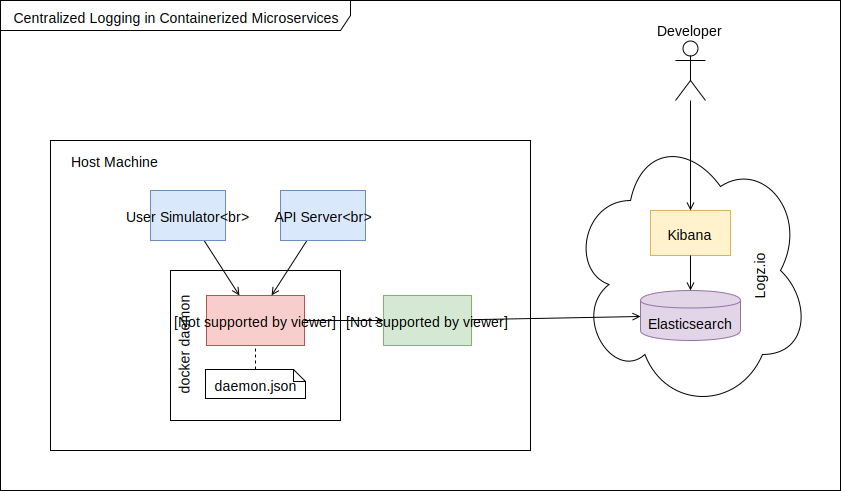

# Horus

Monitoring containerized microservices with a centralized logging architecture.

## Dependencies

- Docker Compose v1.22.0

## Setup

1. For each microservice, rename `example.env` to `.env` and supply the needed secrets.

		docker-compose up -d
		
2. Then log into [Logz.io](logz.io) or your preferred ELK SaaS to view your microservices logs.

## Project Documentation

### System Architecture

I wrote an accompanying [Medium article]() detailing the rationale for this architecture.

## Developer Notes

### Docker Networking

Containers run isolated by default. For them to comunicate with one another, you need to place them on the same network. We do this using Docker Compose

### Best practices

1. You can pass secrets for a microservice using the `env_file` attribute in `docker-compose.yml`
2. Microservices can communicate using their service names if they are in the same docker `network`

### Known issues

1. Some values like service hostnames are specified in 2 places: the docker-compose file, and the service-specific .env file (like for the API BaseURL)
2. You have to install a plugin for the ELK-service (logz.io) in the fluentd shipper container
3. Then you have to configure fluentd plugin with your credentials from the ELK service.
